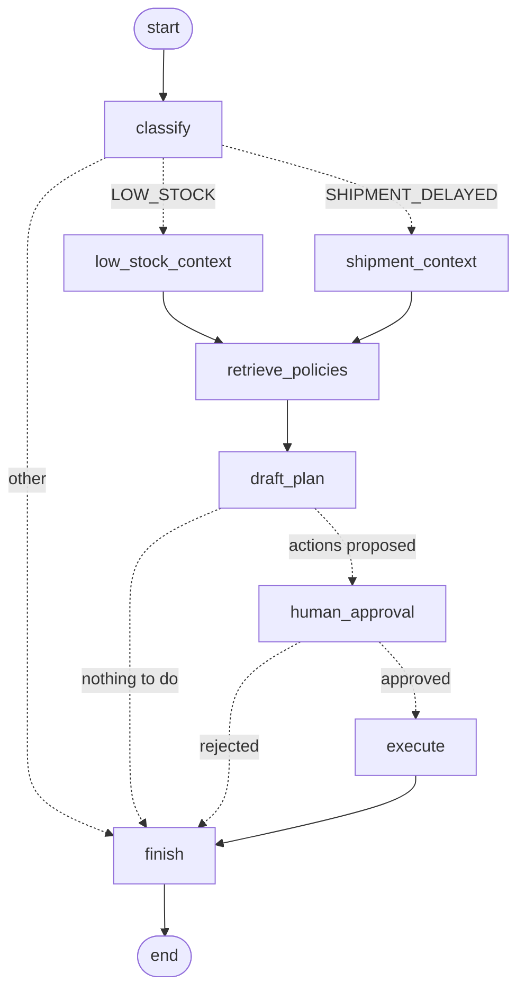

# Supply Chain Management System

[](https://github.com/aishu136/SupplySphere/actions/workflows/ci.yml)

An event-driven supply chain control tower built as domain microservices. It tracks inventory, purchase
orders and shipments, detects problems in real time, and gives operators an AI copilot, RL-driven
replenishment and computer-vision dock inspection.

```
                  ┌──────────────────────────── Angular UI (scm-ui) ────────────────────────────┐
                  │ Dashboard · Inventory · POs · Shipments · RL · AI assistant · Vision         │
                  └──────────────┬───────────────────────────────────────────┬─────────────────┘
                         /api (REST + SSE)                                  /ai
                                 ▼                                           ▼
                  ┌──────────────────────────────┐   REST    ┌─────────────────────────────────┐
                  │ api-gateway (Spring Cloud GW)│◄──────────│ scm-ai-service (Python)          │
                  │ routing · circuit breakers · │           │  LangChain agent → Claude/Bedrock│
                  │ fallbacks · dashboard compose│           │  LangGraph · RAG · vision · RL   │
                  └──┬──────┬──────┬──────┬──────┬┘           │  MCP server (12 tools)           │
                     ▼      ▼      ▼      ▼      ▼            └──────────────┬──────────────────┘
               ┌────────┐┌─────────┐┌───────┐┌──────────┐┌───────┐           │ vision results
               │catalog ││inventory││ order ││ shipment ││ alert │           │
               │service ││ service ││service││ service  ││service│           │
               └───┬────┘└────┬────┘└───┬───┘└────┬─────┘└───┬───┘           │
                   │ own DB   │ own DB  │ own DB  │ own DB    │              │
                   ▼          ▼         ▼         ▼           ▼              ▼
      ┌──────────────────────────────── Kafka ─────────────────────────────────────────────┐
      │ scm.catalog.events (compacted)  scm.inventory.events  scm.order.events              │
      │ scm.shipment.events             scm.alerts            scm.vision.events             │
      └──────────────────────────────┬───────────────────────▲───────────────────────────────┘
                                     ▼                       │ alerts
                     ┌──────────────────────────────────────────┐
                     │ scm-stream-processor (Flink)             │   Jaeger: traces across
                     │ low stock · shipment delay · demand spike│   HTTP and Kafka hops
                     └──────────────────────────────────────────┘
```

| Technology | Where | What it does |
|---|---|---|
| **Spring Boot 3.5 microservices** | `scm-platform/*-service` | Five domain services (catalog, inventory, order, shipment, alert), each with its own database and REST API. See [Microservices](#microservices) |
| **Spring Cloud Gateway** | `scm-platform/api-gateway` | Single entry point: routing, a Resilience4j circuit breaker per downstream with 503 fallbacks, CORS, and a dashboard endpoint that fans out to four services and degrades gracefully |
| **Apache Camel 4** | `inventory-service`, `shipment-service` | Supplier stock-feed ingestion (file → CSV → splitter), and a content-based router for vision inspections (damaged → DAMAGED + critical alert, clean → notes), with dead-letter channels |
| **Kafka** | all | Event backbone: domain events, the delivery saga, catalog state transfer and alerts. All events share one JSON envelope: `eventId, type, source, entityId, timestamp, data` |
| **Apache Flink 1.20** | `scm-stream-processor` | Stateful stream processing: edge-triggered low-stock alerts (keyed state), shipment-ETA timers (processing-time timers), demand spikes (tumbling windows) |
| **OpenTelemetry + Jaeger** | all Java services | Traces follow a request across the gateway, service-to-service REST calls and Kafka hops |
| **LangChain 1.x** | `scm-ai-service/app/agent.py` | `create_agent` with Claude on Bedrock (`ChatBedrockConverse`), per-session memory (LangGraph checkpointer) |
| **LangGraph** | `scm-ai-service/app/workflows/` | Exception-resolution workflow as an explicit `StateGraph`: branches by alert type, gathers live context and the RL recommendation, has Claude draft a plan, then pauses (`interrupt`) for human approval before executing. State is checkpointed to SQLite, so pending approvals survive restarts. The chat agent (`create_agent`) also runs on LangGraph, with a LangGraph checkpointer for memory. See [Exception workflows](#exception-workflows-langgraph) |
| **LangSmith** | `scm-ai-service/app/observability.py`, `evals/` | Tracing of every AI run (chat agent, MCP tool calls, LangGraph workflow, RAG, RL, vision), human feedback on traces (chat ratings, plan approvals), and evaluation of the policy Q&A. Opt-in. See [LangSmith](#langsmith-tracing-feedback-evaluation) |
| **MCP** | `scm-ai-service/app/mcp_server.py` | FastMCP server exposing 12 tools (inventory, POs, shipments, suppliers, alerts, policy search, RL replenishment). The agent loads them with `langchain-mcp-adapters`; Claude Desktop, Claude Code or an AgentCore Gateway can use them too |
| **Tools** | MCP server | Read tools, plus action tools (`create_purchase_order`, `update_shipment_status`) that go through the gateway and each service's business rules |
| **RAG** | `scm-ai-service/app/rag.py` | Supplier contracts and SOPs in `knowledge_base/`, chunked and embedded with Titan v2 into LangChain's vector store (persisted to JSON); answers cite their source file |
| **AWS Bedrock AgentCore** | `app/agentcore_app.py`, `Dockerfile.agentcore` | The same agent, packaged for AgentCore Runtime (`BedrockAgentCoreApp`, `/invocations`), with session IDs mapped to agent memory threads |
| **Computer vision** | `scm-ai-service/app/vision.py` | Dock-photo inspection: YOLO object detection and counting (custom damage classes supported), QR code and barcode decoding with OpenCV, optional structured damage review by Claude. Results flow over Kafka to shipment-service's Camel router |
| **Reinforcement learning agents** | `scm-ai-service/app/rl/` | One policy-search agent (cross-entropy method) per SKU × warehouse learns its reorder point and order quantity in a Gymnasium simulator. Each is benchmarked against the SOP rule on held-out demand and used only where it was cheaper. Exposed in the UI, over REST, and as the MCP tool the copilot uses |
| **Angular 20** | `scm-ui` | Standalone components, signals, zoneless; live alerts over SSE; shows which services are down if the dashboard is degraded |

## Microservices

| Service | Port | Owns (own database) | Publishes | Consumes |
|---|---|---|---|---|
| `catalog-service` | 8081 | suppliers, products | `PRODUCT_UPSERTED` (compacted topic, keyed by SKU) | — |
| `inventory-service` | 8082 | stock per SKU × warehouse; product read model | `INVENTORY_UPDATED` | catalog events, `ORDER_RECEIVED` |
| `order-service` | 8083 | purchase orders | `ORDER_CREATED` / `SHIPPED` / `RECEIVED` / … | shipment events |
| `shipment-service` | 8084 | shipments, inspection notes | `SHIPMENT_*`, damage alerts | vision inspection results |
| `alert-service` | 8085 | recent alerts (rebuilt from the retained topic) | — | `scm.alerts` (Flink + services) |
| `api-gateway` | 8080 | — | — | routes `/api/**` to the services above |

**Patterns used**
- **Database per service.** No service reads another's tables, and cross-service references use business keys
  such as `orderNumber` and `sku`, not foreign keys.
- **Saga (choreography).** A delivery spans three services with no distributed transaction:
  `SHIPMENT_DELIVERED` (shipment-service) → order `RECEIVED`, emits `ORDER_RECEIVED` (order-service) →
  stock increased (inventory-service).
- **Idempotent consumers.** Kafka delivers at least once. inventory-service records processed event IDs, so a
  redelivered `ORDER_RECEIVED` never books stock twice. order-service is idempotent by order state.
- **Publish after commit.** Events are sent to Kafka only after the database transaction commits
  (`@TransactionalEventListener`), so no service sees an event for a rolled-back change. For delivery
  guarantees across crashes, the next step would be a transactional outbox.
- **Event-carried state transfer.** catalog-service publishes products to a compacted topic, and
  inventory-service keeps a local copy to render product details without a synchronous call.
- **Synchronous calls where freshness matters.** order-service → catalog-service (a PO captures the current
  supplier, price and lead time) and shipment-service → order-service (a shipment must reference a real
  PO). Both are guarded by Resilience4j circuit breakers and timeouts, so an outage returns 503 quickly.
- **API gateway and composition.** One entry point for the UI and the AI service. The dashboard aggregates
  four services in parallel and still answers when one is down.
- **Observability.** OpenTelemetry traces for every hop (HTTP and Kafka) in Jaeger, and health and
  circuit-breaker state on `/actuator`.

## Running the stack (Docker)

The microservices need Kafka and Postgres, so Docker Compose is the way to run the platform:

```bash
(cd scm-stream-processor && ./gradlew shadowJar)   # builds the Flink job jar
docker compose up --build
```

| URL | Service |
|---|---|
| http://localhost:8081 | Angular UI |
| http://localhost:8080 | API gateway (all `/api/**` endpoints) |
| http://localhost:8000/docs | AI service (OpenAPI) |
| http://localhost:16686 | Jaeger (distributed traces) |
| http://localhost:8082 | Flink dashboard |
| http://localhost:8090 | Kafka UI |

AWS credentials are passed from your environment or `~/.aws`. To try the Camel feed route, copy
`scm-platform/inventory-service/samples/supplier-feed-sample.csv` into `data/inbox/supplier-feeds/`. The
file is picked up, applied, and moved to `.done/`.

`scripts/e2e-smoke.sh` checks a running stack end to end:
- the saga
- Flink alerts
- the LangGraph workflow: a Flink alert starts it over Kafka, it survives an AI-service restart while
  waiting for approval, and once approved it creates the purchase order
- gateway fallbacks with a service stopped
- traces in Jaeger

CI runs it on every push, in GitHub Actions (`.github/workflows/ci.yml`) and in Jenkins (`Jenkinsfile`).
The Jenkins pipeline runs the same stages; it needs an agent labelled `docker` with Docker, Compose and
Buildx, and the Docker Pipeline plugin.

### Developing without Docker

Each service runs with `./gradlew :<service>:bootRun` from `scm-platform` (H2 in-memory database, ports
8081–8085, gateway on 8080), but it needs a Kafka broker on `localhost:9092`. The AI service and UI run
as before:

```bash
cd scm-ai-service
python -m venv .venv && .venv\Scripts\activate        # source .venv/bin/activate on macOS/Linux
pip install -r requirements.txt
copy .env.example .env                                 # set AWS_REGION / BEDROCK_MODEL_ID
python -m app.mcp_server                               # MCP server on :8001
uvicorn app.main:app --port 8000                       # AI service, in a second terminal

cd scm-ui && npm install && npm start                  # UI on :4200, proxies /api and /ai
```

## Bedrock model

The default is `anthropic.claude-opus-5`, set with `BEDROCK_MODEL_ID`. If your account requires a
cross-region inference profile, use its ID instead (e.g. `us.anthropic.claude-opus-5`). The model must be
enabled in the Bedrock console for your region.

## Deploying the agent to Bedrock AgentCore Runtime

```bash
pip install bedrock-agentcore-starter-toolkit
cd scm-ai-service
agentcore configure --entrypoint app/agentcore_app.py --name scm_agent
agentcore launch --env SCM_MCP_URL=https://<your-mcp-endpoint>/mcp --env BEDROCK_MODEL_ID=anthropic.claude-opus-5
agentcore invoke '{"prompt": "Which shipments are late and what penalties apply?"}'
```

The agent needs a reachable MCP endpoint. Either deploy `app/mcp_server.py` as a second AgentCore
Runtime with the MCP protocol, or register the core REST API as targets on an AgentCore Gateway.
`Dockerfile.agentcore` is a minimal ARM64 image if you prefer to build and push to ECR yourself.

## Computer vision models

`YOLO_MODEL` defaults to `yolo11n.pt` (COCO weights, downloaded on first use). COCO covers generic
object detection and counting but has no damage classes. For production damage detection, fine-tune a
YOLO model on your dock photos with classes such as `dent`, `tear`, `crushed` and `wet` (see `DAMAGE_LABELS`),
then point `YOLO_MODEL` at the weights. Until then, tick **Claude visual review** in the UI to get a damage
assessment from Claude.

## Exception workflows (LangGraph)

When Flink raises a `LOW_STOCK` or `SHIPMENT_DELAYED` alert, the AI service (consuming `scm.alerts`)
starts a LangGraph workflow for it. You can also start one from the **Exception workflows** page.



| Node | What it does |
|---|---|
| `classify` | Routes by alert type (conditional edges) |
| `low_stock_context` | Stock per warehouse, open POs, and the RL agent's recommendation for the SKU |
| `shipment_context` | The shipment, its purchase order, and stock at the destination |
| `retrieve_policies` | RAG over the SOPs (reorder policy or delay escalation) |
| `draft_plan` | Claude produces a structured `Plan` (summary, rationale, actions). If Claude is unreachable, a rule-based plan built from the RL recommendation is used. Actions are allow-listed and validated |
| `human_approval` | `interrupt()`: the graph stops until a person approves, edits quantities, or rejects |
| `execute` | Runs the approved actions through the API gateway (create PO, update shipment status) |
| `finish` | Records the outcome: `completed`, `partially_failed`, `rejected` or `no_action` |

**Durable state.** Checkpoints go to SQLite (`data/workflows.sqlite`) through `AsyncSqliteSaver`, so a
workflow waiting for approval survives a restart and resumes where it stopped.

**Idempotent.** The thread ID is `exception-<alertId>`, so a redelivered alert reuses its workflow
instead of starting a second one.

| Endpoint | Purpose |
|---|---|
| `GET /ai/workflows/exceptions` | Workflows, pending approvals first |
| `POST /ai/workflows/exceptions {"alert": {...}}` | Start a workflow for an alert |
| `POST /ai/workflows/exceptions/{id}/decision {"approved": true, "actions": [...], "comment": "..."}` | Approve (optionally with edited actions) or reject |
| `GET /ai/workflows/exceptions/graph` | The compiled graph as Mermaid |

## LangSmith (tracing, feedback, evaluation)

LangSmith is **opt-in**. With nothing configured, no data leaves the service. To turn it on, set these
in `scm-ai-service/.env` or the environment (Docker Compose passes them through to `scm-ai`, and
AgentCore takes them with `agentcore launch --env ...`):

```bash
LANGSMITH_TRACING=true
LANGSMITH_API_KEY=lsv2_...
LANGSMITH_PROJECT=supplysphere
```

Traces contain prompts, retrieved documents and supply chain records. Set `LANGSMITH_HIDE_INPUTS=true`
and/or `LANGSMITH_HIDE_OUTPUTS=true` to redact them.

### Where it is used

| Feature | What appears in LangSmith | How |
|---|---|---|
| **AI assistant** (`app/agent.py`) | One trace per chat turn, named `supplychain-copilot`: every Claude call, and every MCP tool call with its arguments and result. Tagged `chat` + `fastapi` or `agentcore`, with the `session_id` in metadata | Automatic LangChain/LangGraph tracing; `run_config()` sets the name, tags and metadata, and a known `run_id` |
| **Chat feedback** (`POST /ai/chat/feedback`, 👍/👎 in the UI) | Feedback `user_rating` (1 or 0) on that turn's trace | `Client.create_feedback` with the turn's `run_id` |
| **Exception workflow** (`app/workflows/`) | `exception-workflow:plan` and `exception-workflow:decision` traces with every LangGraph node: context gathering, retrieval, Claude's structured plan, execution. Filterable by `thread_id`, `alert_id`, `alert_type` | Automatic LangGraph tracing plus `run_config()` metadata |
| **Plan approval as feedback** | On the `draft_plan` run: `plan_approved` (1/0) with the approver's comment, and `plan_edited` (1/0) when quantities were changed. This gives a measured approval and edit rate for the Claude planner against the rule-based fallback | `draft_plan` records its run ID (`current_run_id()`); `decide()` attaches the human decision to it |
| **Policy Q&A / RAG** (`app/rag.py`) | `policy_qa` chain, with a `policy_retrieval` retriever run showing the retrieved chunks, then the Claude call | `@traceable(run_type="retriever")` and `@traceable(run_type="chain")` |
| **RL replenishment** (`app/rl/service.py`) | `rl_replenishment_recommendations` and `rl_train_agents` runs, nested inside the chat or workflow trace that called them | `@traceable(run_type="tool")` |
| **Vision inspection** (`app/vision.py`) | `vision_inspection` run with the verdict, detections and Claude's assessment. Only the image size is recorded, never the image bytes or the annotated image | `@traceable` with `process_inputs` / `process_outputs` redaction |
| **MCP server** (`app/mcp_server.py`) | Retrieval and RL calls made when an MCP client uses the tools | `configure()` at startup, so the same decorators apply |
| **Evaluation** (`evals/policy_qa.py`) | Dataset `supplysphere-policy-qa` (6 questions whose expected facts come from `knowledge_base/`), and an experiment per run scored on `facts_covered`, `cites_source` and `retrieval_hit` | `langsmith.aevaluate` with three code evaluators |

Run the evaluation after changing a prompt, the model or retrieval, and compare the experiments in
LangSmith:

```bash
cd scm-ai-service
python -m evals.policy_qa        # needs LangSmith and AWS Bedrock credentials
```

`/ai/health` reports `"langsmith": true|false`.

## Reinforcement learning replenishment

**Problem.** A fixed rule ("order the standard quantity at the reorder point") ignores each item's cost
trade-offs. For a cheap carton, a stock-out costs far more than holding extra stock. For a $64 controller
board, carrying 100 units costs more than ordering smaller batches more often.

**Environment** (`app/rl/env.py`, a Gymnasium `Env`). One simulated day per step:
1. Orders placed `lead_time_days` earlier arrive.
2. The agent chooses how many units to order.
3. Poisson demand is served, and any unmet demand is lost.

The reward is the negative daily cost: holding (25%/yr of unit value), lost sales (1.5× unit price) and a
fixed cost per order.

**Parameters from live data.** Lead time comes from the supplier record, and the price and standard
quantity from the product. Daily demand is inferred by inverting the reorder-point formula in
`knowledge_base/reorder_policy.md`.

**Agent** (`app/rl/agent.py`). Policy-search RL with the cross-entropy method, one agent per SKU ×
warehouse.
- Each iteration samples 40 candidate (reorder point *s*, order quantity *Q*) policies.
- It runs them all on the same 100 simulated demand paths in a vectorized twin of the environment (a test
  checks the twin against the Gymnasium env).
- It refits to the cheapest 8.

The search starts from the SOP policy and trains in about one second per position. The result is a policy
a planner can read, e.g. "order 62 when position ≤ 42".

> Tabular Q-learning was tried first. Lost-sales costs land a full lead time (7–21 days) after the
> decision, the value estimates drowned in demand noise, and results varied wildly between random seeds.
> Policy search over interpretable policies was stable across seeds and beat the SOP rule on every
> seed-data item.

**Guardrail.** Each learned policy is evaluated against the SOP rule in the Gymnasium env on 50 held-out
demand scenarios that were never used in training. A recommendation uses the learned quantity only where
it had the lower cost. `policyUsed` says which one applied.

Benchmark on the seed-data item profiles (simulated 120-day cost, held-out demand, 3 training seeds each):

| Item | SOP s / Q | Learned s / Q | SOP cost | RL cost |
|---|---|---|---|---|
| Hex bolts @ WH-WEST | 120 / 400 | ≈103 / 336 | 436 | ≈396 (−9%) |
| Cartons @ WH-WEST | 1000 / 5000 | ≈857 / 3320 | 289 | ≈220 (−24%) |
| Stretch wrap @ WH-WEST | 30 / 100 | ≈33 / 110 | ≈220 | ≈207 (−6%) |
| Temp sensor @ WH-EAST | 50 / 300 | ≈48 / 225 | ≈202 | ≈160 (−21%) |
| Gateway board @ WH-EAST | 40 / 100 | ≈42 / 63 | ≈438 | ≈390 (−11%) |

| Endpoint / tool | Purpose |
|---|---|
| `GET /ai/rl/recommendations` | Order quantity per position from its live state (trains missing or stale agents first) |
| `POST /ai/rl/train {"iterations": 40}` | Retrain every agent |
| MCP `get_replenishment_recommendations` | Same data for the LangChain agent or any MCP client |
| UI **RL replenishment** page | Compare SOP and learned policies, cost and fill rate, and place the recommended PO in one click |

Trained policies are saved in `scm-ai-service/data/rl_policies.json`. An agent retrains automatically
when its position's reorder point, reorder quantity, price or lead time changes.

## Try it

- **Dashboard:** the seed data has two low-stock positions and one overdue ocean shipment (`TRK-DEMO000002`).
- **Inventory:** adjust `SKU-3002 @ WH-EAST` by `-90` and watch Flink's LOW_STOCK alert appear live.
- **Exception workflows:** start one from a LOW_STOCK alert, edit the proposed quantity, approve it.
- **RL replenishment:** see where the learned policy beats the SOP rule, then place its PO.
- **Assistant:** ask *"Which items are below their reorder point, and what does the reorder policy say to do?"*
- **Vision:** open a shipment's **Inspect** link and upload a photo of the package.

## Tests

```bash
cd scm-platform && ./gradlew build        # 6 services, 16 tests: saga, idempotency, circuit breakers (embedded Kafka)
cd scm-ai-service && pytest              # LangGraph, LangSmith, RL, RAG (offline), vision, MCP tools, events
cd scm-ui && npx ng build                # strict template type-check
```
